# Data Analysis — Olist E-commerce T-SQL, ER Modeling & Northwind

[](Assignment%20%2302/Assignment_2_i222327/Assignment%20%2302_SQL.sql)
[](#feature-screenshots-20)
[](#problem-statement--academic-context)

Database coursework in **T-SQL (SQL Server)**:

- **Assignment #01** — ER diagrams (draw.io + PNG)
- **Assignment #02** — `ECOMMERCE` schema, `BULK INSERT`, 32 analytical queries on **Olist**
- Exported **CSV + chart** packs for Order / Customer / Product / Seller themes
- **Northwind** sample DB script for extra practice
- **20 labelled feature screenshots** + SSMS runbook / FK-safe load order

**Author:** Mohammad Rohaan · **Roll:** 22I-2327 · [rohaan2802](https://github.com/rohaan2802)

Canonical script: [`Assignment #02/Assignment_2_i222327/Assignment #02_SQL.sql`](Assignment%20%2302/Assignment_2_i222327/Assignment%20%2302_SQL.sql)

---

## Live demo

There is no hosted web app — the “demo” is the graded SQL + exported charts. Open these directly:

Primary analysis pack (Order / Customer / Product / Seller folders):

https://github.com/rohaan2802/Data-Analysis/tree/main/Assignment%20%2302/Assignment_2_i222327

Canonical T-SQL script:

https://github.com/rohaan2802/Data-Analysis/blob/main/Assignment%20%2302/Assignment_2_i222327/Assignment%20%2302_SQL.sql

Labelled screenshot gallery (this README):

https://github.com/rohaan2802/Data-Analysis/tree/main/docs/screenshots

Assignment #01 ER diagrams:

https://github.com/rohaan2802/Data-Analysis/tree/main/Assignment%20%2301

Northwind practice script:

https://github.com/rohaan2802/Data-Analysis/blob/main/NorthWind%20DataBase/NorthWind%20DataBase.sql

---

## Table of contents

1. [Live demo](#live-demo)
2. [Quick start](#quick-start)
3. [Feature screenshots (20)](#feature-screenshots-20)
4. [Deep feature walkthrough](#deep-feature-walkthrough)
5. [Problem statement / academic context](#problem-statement--academic-context)
6. [Features](#features)
7. [Architecture / design](#architecture--design)
8. [Extra docs pack](#extra-docs-pack)
9. [Olist schema](#olist-schema)
10. [Bulk load (CSV → SQL Server)](#bulk-load-csv--sql-server)
11. [Analysis questions A–H](#analysis-questions-ah-as-written)
12. [Exported result highlights](#exported-result-highlights)
13. [Assignment #01 — ER modeling](#assignment-01--er-modeling)
14. [Northwind](#northwind)
15. [Tech stack](#tech-stack)
16. [Project structure](#project-structure)
17. [Prerequisites](#prerequisites-and-install)
18. [How to build and run](#how-to-build-and-run)
19. [Known limitations](#known-limitations--bugs)
20. [How to extend](#how-to-extend)
21. [Author](#author)

---

## Quick start

1. Open the [Live demo](#live-demo) links (full URLs — not “click here”).
2. Skim [Feature screenshots (20)](#feature-screenshots-20).
3. Follow [`docs/ssms-runbook.md`](docs/ssms-runbook.md) + [`docs/load-order.md`](docs/load-order.md).
4. Edit every `BULK INSERT ... FROM` path in the SQL file, then execute in SSMS.

---

## Feature screenshots (20)

Old `docs/screenshots` embeds were replaced with this labelled set (optimized JPGs). Each heading is one project feature.

### 1. ER Task 1 — customers & orders

Assignment #01 conceptual model linking customers, orders, and core commerce entities.

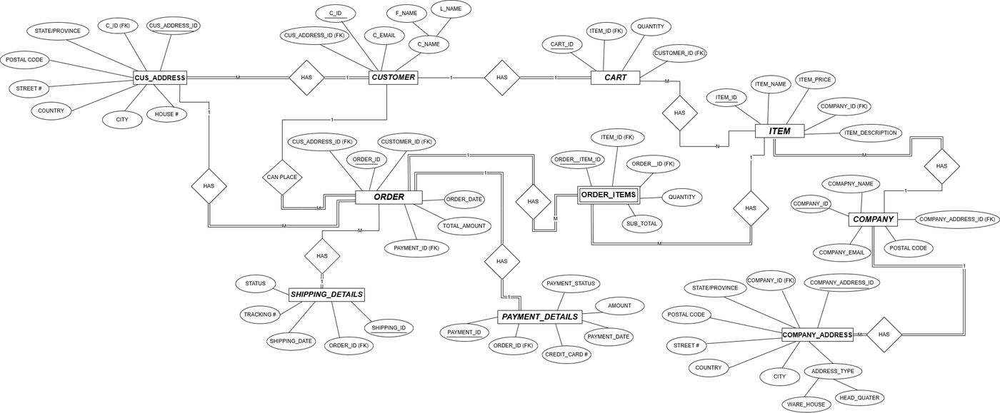

### 2. ER Task 3 — shipping & payments

Extended ER covering shipment and payment relationships.

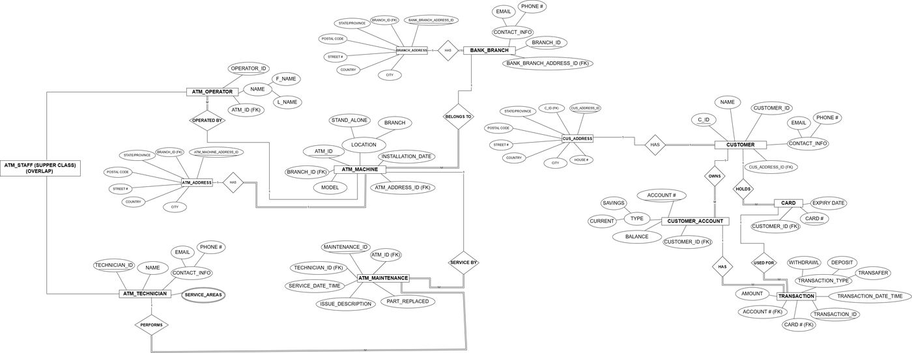

### 3. ER Task 5 — extended model

Further section-A modeling refinements from Assignment #01.

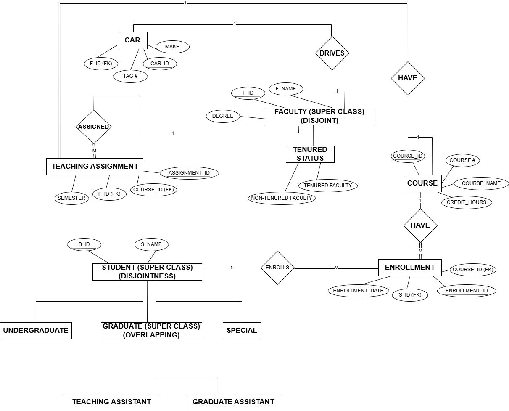

### 4. Order — peak months of delays

Late deliveries (`delivered_customer > estimated`) by month. April peaks (**1,565**); July is lightest (**216**).


### 5. Order — delays by customer state

Geographic late-delivery counts. **SP** leads (**2,387**), then RJ and MG.

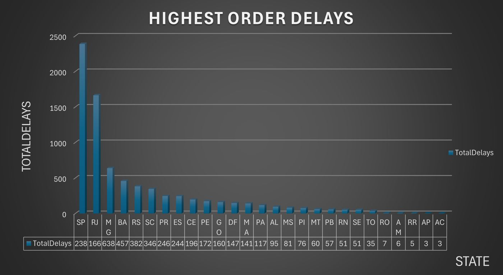

### 6. Order — average delay days by seller

Which sellers show the longest mean delay (days after estimate).

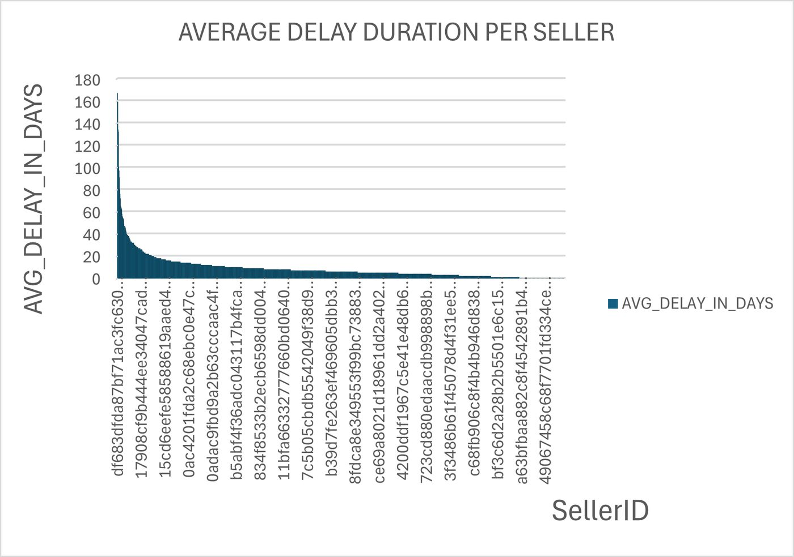

### 7. Order — delays by product category

Fulfillment risk by catalog segment (`product_catery_name`).

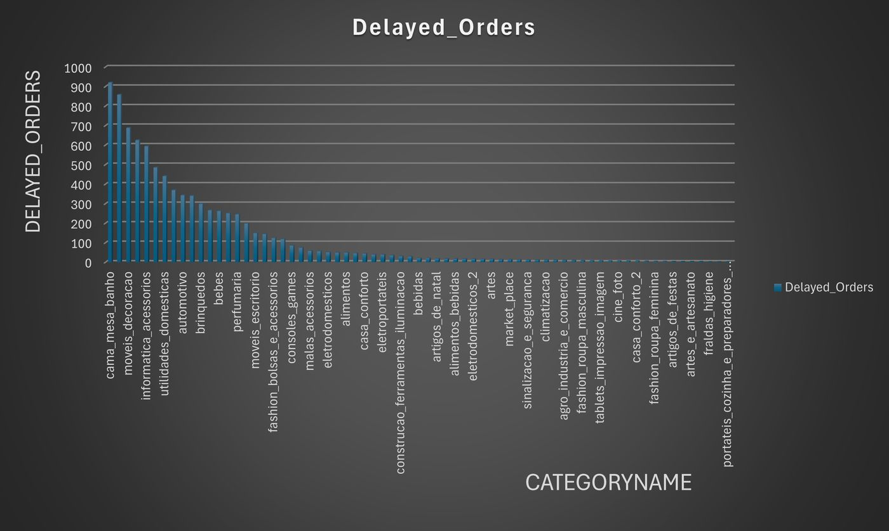

### 8. Customer — average order price by state

Mean `payment_value` by `customer_state`. **PB** highest (~**248.33**); **SP** lowest among listed (~**137.50**).

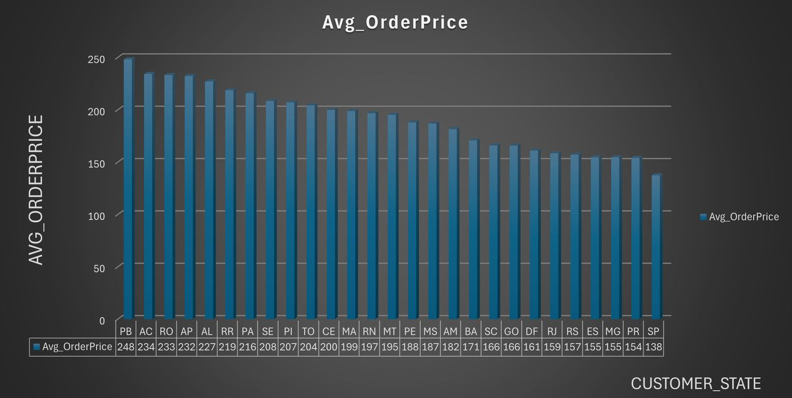

### 9. Customer — longest average delivery time

Customers with the highest mean purchase→delivery duration (delivered orders).

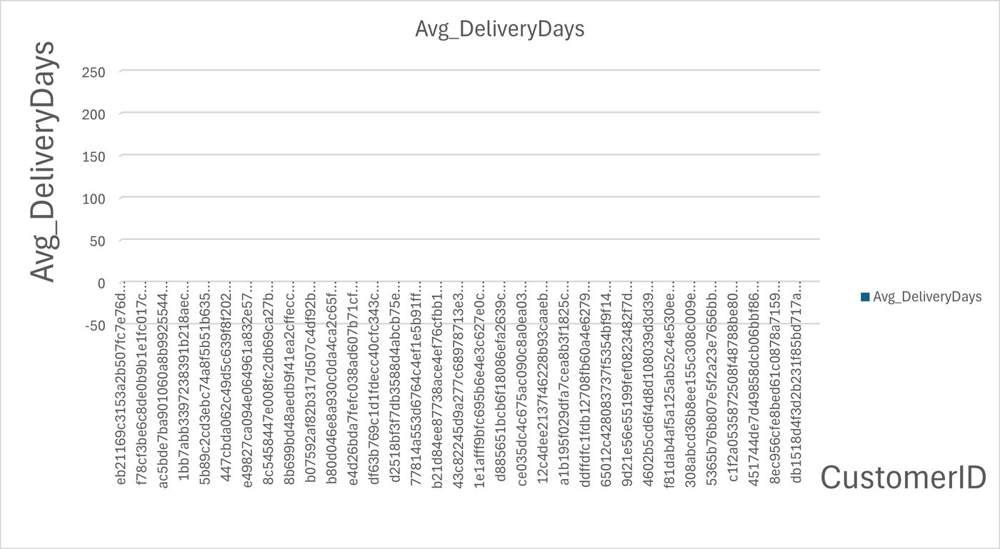

### 10. Customer — highest cancellations

Customers ranked by canceled-order counts (assignment wording: “cancellations”).

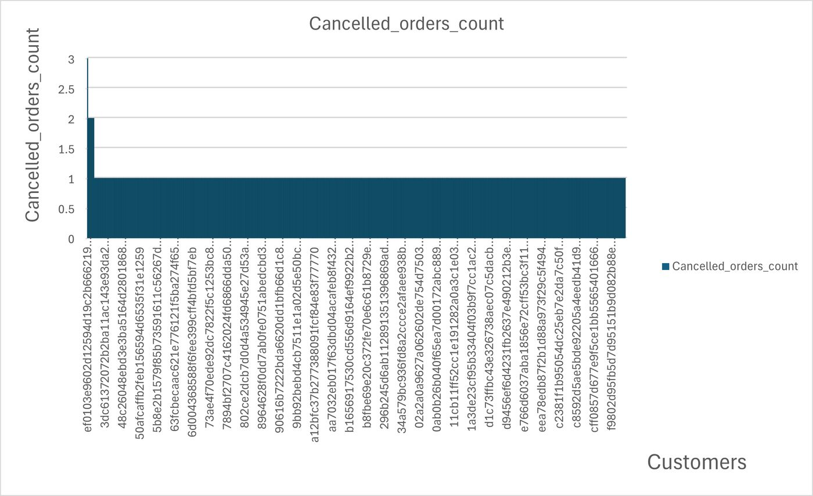

### 11. Product — top category by state

Most profitable category (total sales) inside each customer state.

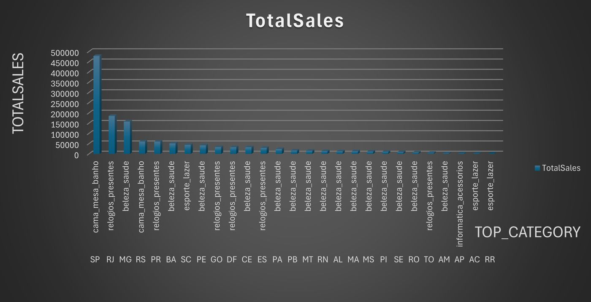

### 12. Product — peak order hours by category

Hour-of-day with the most placements per category (e.g. bed/bath hour **14**).

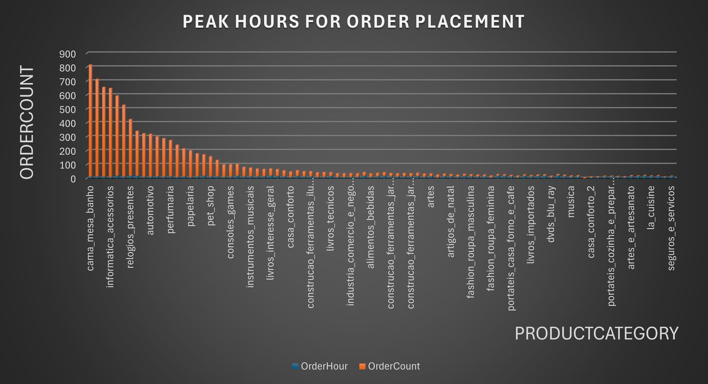

### 13. Product — price vs sales volume

How average product price relates to delivered order volume.

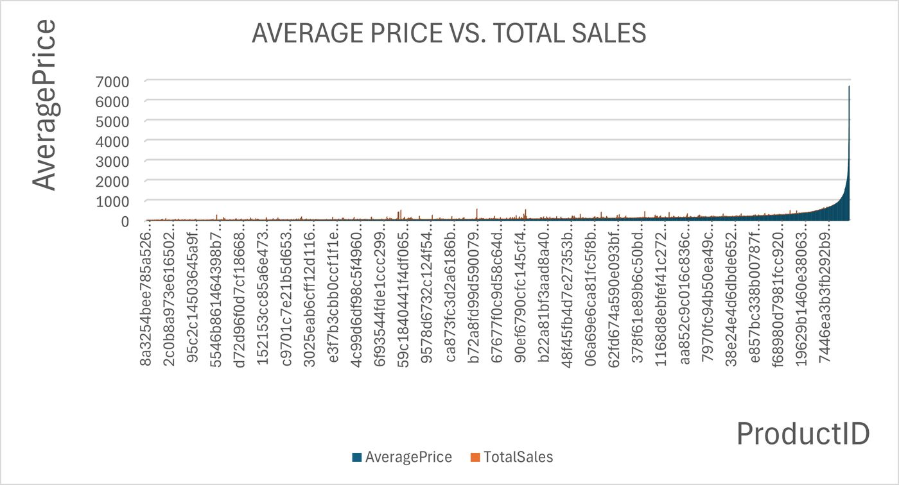

### 14. Product — frequently bought together

Self-joined product pairs that co-occur on orders (`product_id < product_id`).

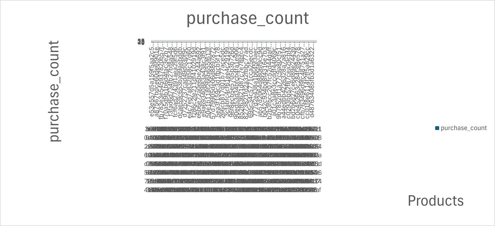

### 15. Product — revenue by category (English)

Delivered `SUM(price)` with PT→EN translation. Top: **health_beauty**, **watches_gifts**, **bed_bath_table**.


### 16. Product — average review by category

Mean review score (1–5). Tiny-n categories can show perfect 5s — interpret carefully.

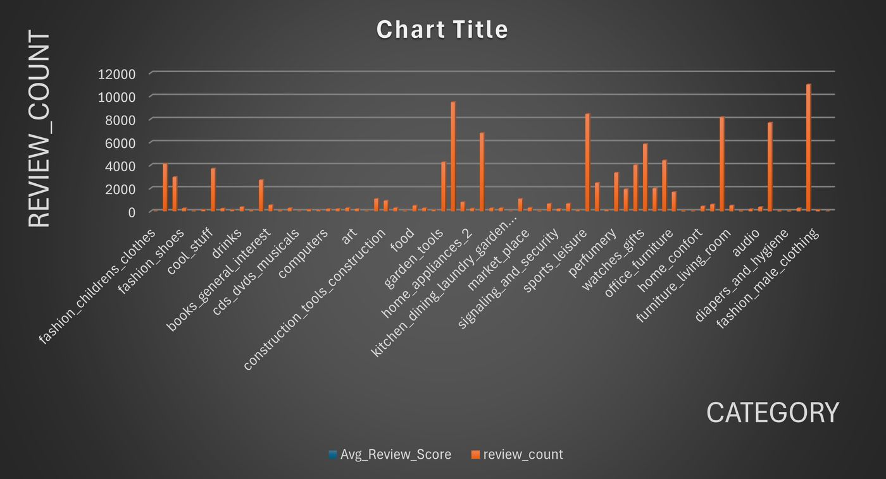

### 17. Seller — cancel rate (“return rate” label)

Canceled item-rows / all item-rows × 100. Small sellers can hit 100% with n=1.

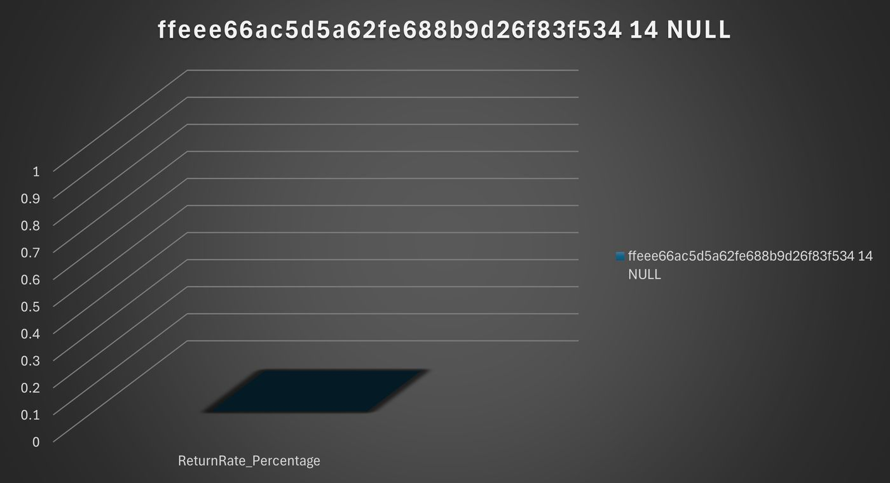

### 18. Seller — highest average product price

Sellers ranked by `AVG(price)` on delivered items.

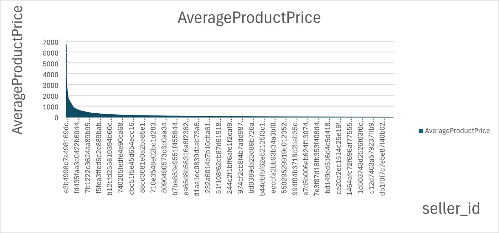

### 19. Seller — profit margin proxy

`(price − freight) / price`. Freight is **shipping**, not COGS — treat as a proxy only.

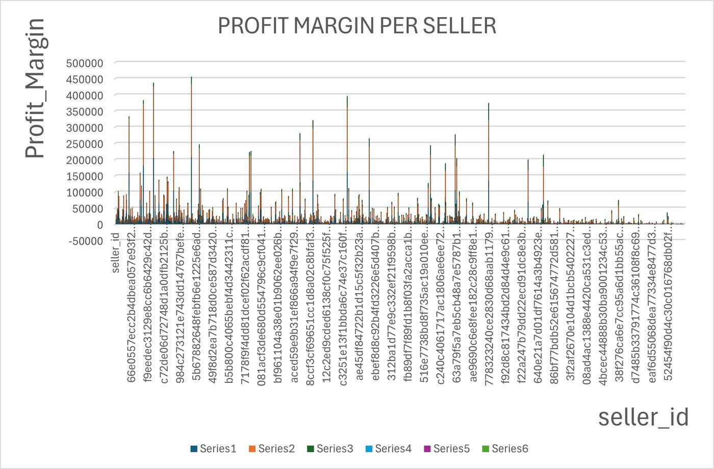

### 20. Seller — total freight cost

`SUM(freight_value)` per seller on delivered items — logistics cost concentration.

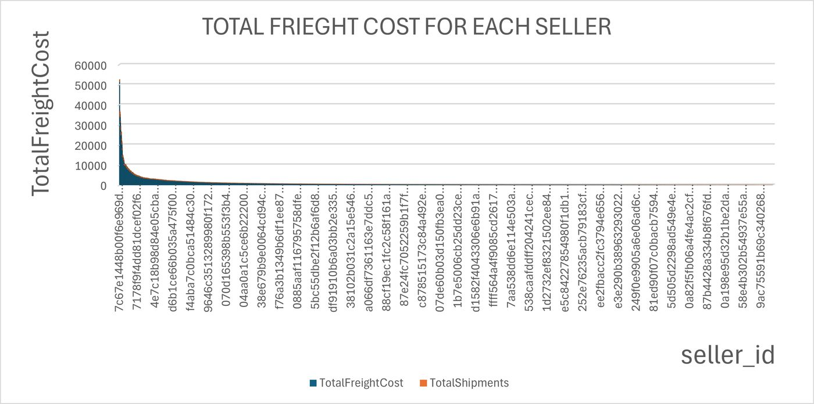

---

## Deep feature walkthrough

### A. ER modeling (screenshots 01–03)

Assignment #01 builds the conceptual backbone before SQL: entities, keys, and relationships for commerce (customers, orders, payments, shipping). Open `.drawio` in [diagrams.net](https://app.diagrams.net/) to edit; PNGs are the graded visuals.

### B. Order analytics (04–07)

Delay is defined when customer delivery is **after** the estimated date. Features answer: *when* delays peak (month), *where* (state), *which sellers* are slowest, and *which categories* suffer most. Uses `DATEDIFF`, `DATEPART`/`MONTH`, and joins through `Orders` → `Customers` / `Order_Items` → `Products`.

### C. Customer analytics (08–10)

Spend concentration by state, delivery-time outliers, and cancellation heavy-hitters. Helps separate “many late deliveries in SP because volume is huge” from “individual customers with extreme lead times.”

### D. Product analytics (11–16)

Catalog intelligence: regional category winners, time-of-day demand, price–volume relationship, market-basket pairs, translated revenue leaderboard, and review quality by category. English names come from `product_category_name_translation` (table spelling keeps `catery`).

### E. Seller & shipment analytics (17–20)

Seller health proxies: cancel rate (mislabelled “return” in the brief), average selling price, freight-based margin proxy, and total freight. Always read small-n artefacts (100% cancel with one order).

### F. Schema + constraints

PKs/FKs/`CHECK`s encode domain rules: order status enum, payment types, review scores 1–5, geo lat/lng ranges, timestamp ordering (approved ≥ purchase, etc.). Several FKs use `ON DELETE CASCADE`.

### G. Bulk load + geo dedupe

UTF-8 `BULK INSERT` with `FIRSTROW = 2`, often `TABLOCK` / `KEEPNULLS`. Geolocation uses a **staging** table + `ROW_NUMBER()` CTE so one lat/lng survives per `(zip, city, state)`.

### H. Northwind sidecar

Separate Microsoft sample for views/procedures practice — **not** joined to Olist.

---

## Problem statement / academic context

Olist is a Brazilian marketplace dump: customers, sellers, orders, payments, items, reviews, products, geolocation, and Portuguese→English categories. Assignment 02: create **`ECOMMERCE`**, load CSVs, enforce integrity, dedupe geo, then answer **four thematic blocks** (Order / Customer / Product / Seller-and-shipment), each with questions **a–h**. Results live under the four `*_ANALYSIS` folders.

---

## Features

- `CREATE DATABASE ECOMMERCE` + `USE` + `GO` batches
- Tables with PKs, FKs (`ON DELETE CASCADE` on several), domain `CHECK`s
- UTF-8 bulk load (`CODEPAGE = '65001'`) where specified
- Geolocation staging + `ROW_NUMBER()` dedupe
- 32 analysis `SELECT`s (8 × 4 themes)
- Exported CSV/PNG evidence packs
- Assignment #01 draw.io ER set
- Northwind installer script
- 20 README screenshots + docs runbook / load-order / query index

---

## Architecture / design

```text
olist_*.csv  ──BULK INSERT──►  ECOMMERCE (SQL Server)
                                      │
                    Task 1: DDL + cleaning (geo CTE, CHECKs)
                                      │
                    Task 2: retrieval (Order / Customer / Product / Seller)
                                      │
                         CSV + PNG exports (SSMS / Excel)
                                      │
                         docs/screenshots (README gallery)
```

**FK-safe create order:** Geolocation + category translation **first**, then Customers / Sellers / Products, then Orders and children. Details: [`docs/load-order.md`](docs/load-order.md).

---

## Extra docs pack

| Doc | Role |
|-----|------|
| [`docs/ssms-runbook.md`](docs/ssms-runbook.md) | End-to-end SSMS steps |
| [`docs/load-order.md`](docs/load-order.md) | Parent/child create + load order |
| [`docs/query-index.md`](docs/query-index.md) | Which a–h letters have exports |
| [`docs/README.md`](docs/README.md) | Docs map |
| [`LICENSE`](LICENSE) | MIT for coursework packaging |
| [`TREE.txt`](TREE.txt) | Layout snapshot |

---

## Olist schema

Column `product_catery_name` spelling is intentional (matches the script + translation table).

| Table | Keys / CHECKs (from DDL) |
|-------|--------------------------|
| `Geolocation` | PK `(zip, city, state)`; lat/lng ranges; state length 2 |
| `Geolocation_Staging` | Raw load; dropped after CTE insert |
| `Customers` | PK `customer_id`; FK Geolocation CASCADE |
| `Sellers` | PK `seller_id`; FK Geolocation |
| `Product_Catery_Name_Translation` | PK Portuguese name → English |
| `Products` | PK `product_id`; FK category; dimension CHECKs |
| `Orders` | Status enum; timestamp ordering CHECKs; FK Customers CASCADE |
| `Order_Payments` | PK `(order_id, sequential)`; payment-type enum |
| `Order_Items` | PK `(order_id, item_id)`; FKs Orders/Products/Sellers |
| `Order_Reviews` | Score 1–5; answer ≥ creation when both set |

---

## Bulk load (CSV → SQL Server)

```sql
BULK INSERT Orders
FROM 'C:\PATH\TO\olist_orders_dataset.csv'
WITH (
    FORMAT = 'CSV',
    FIELDTERMINATOR = ',',
    ROWTERMINATOR = '\n',
    FIRSTROW = 2,
    CODEPAGE = '65001',
    KEEPNULLS,
    TABLOCK
);
```

**Replace every `FROM` path** before running. Original machine path was `C:\Users\ALLEN PROGRAMMER\Downloads\`. Point at `Assignment_2_i222327/` or `Brazilian_Dataset/`.

Geolocation dedupe pattern:

```sql
WITH UniqueGeo AS (
    SELECT *, ROW_NUMBER() OVER (
        PARTITION BY geolocation_zip_code_prefix, geolocation_city, geolocation_state
        ORDER BY geolocation_lat, geolocation_lng
    ) AS rn
    FROM Geolocation_Staging
)
INSERT INTO Geolocation (...)
SELECT ... FROM UniqueGeo WHERE rn = 1;
```

This repo is **SQL Server / T-SQL**, not MySQL.

---

## Analysis questions A–H (as written)

Wording below follows the SQL comments (including typos). Full export coverage: [`docs/query-index.md`](docs/query-index.md).

### Order analysis

| | Question | Idea |
|--|----------|------|
| a | % orders delayed beyond estimate | `delivered_customer > estimated` |
| b | Peak months of delays | Monthly counts |
| c | State with highest delays | Join customers, group state |
| d | Pending (`processing`) per year | Status filter |
| e | Avg delay duration per seller | `AVG(DATEDIFF(...))` |
| f | Shipping cost vs delays | Freight avg delayed vs on-time |
| g | Category with most delays | Count by `product_catery_name` |
| h | Items per order vs delays | Item aggregation delayed vs on-time |

### Customer analysis

| | Question | Idea |
|--|----------|------|
| a | % one-time customers | `COUNT(order_id)=1` |
| b | Top 5 cities with repeat customers | `HAVING COUNT > 1` |
| c | Avg order price by state | `AVG(payment_value)` |
| d | Top 10 customers by order count | `TOP 10` |
| e | Longest avg delivery time | `AVG(DATEDIFF(...))` |
| f | Avg orders per customer per year | Orders / distinct customers |
| g | Top spenders in 2017 | Delivered + year window |
| h | Highest cancellations | `order_status = 'canceled'` |

### Product analysis

| | Question | Idea |
|--|----------|------|
| a | Most profitable category per state | Max `SUM(price)` |
| b | Peak hours per category | Hour with max count |
| c | Top 5 categories by delayed orders | With EN names |
| d | Price vs sales volume | Avg price vs counts |
| e | Bought-together pairs | Self-join |
| f | Revenue per category | Delivered `SUM(price)` |
| g | Avg review per category | `AVG(review_score)` |
| h | Top 5 products by revenue | `TOP 5 SUM(price)` |

### Seller and shipment analysis

| | Question | Idea |
|--|----------|------|
| a | “Return” rate per seller | Cancel rate on item rows |
| b | Highest avg product price | `AVG(price)` |
| c | Profit margin per seller | `(price − freight)/price` |
| d | Shipping cost delayed vs not | Two avgs / `UNION ALL` |
| e | Delayed shipments in 2017 | Year filter |
| f | Freight vs delivery speed | Same comparison family as (d) |
| g | Total freight per seller | `SUM(freight_value)` |

---

## Exported result highlights

From the GitHub CSV packs:

- **Order B:** Apr **1565** … Jul **216** delays  
- **Order C:** SP **2387**, RJ **1664**, MG **638** …  
- **Customer C:** PB **~248.33** highest mean payment; SP **~137.50**  
- **Product F:** `health_beauty` **~1.23M**, `watches_gifts` **~1.17M**, `bed_bath_table` **~1.02M**  
- **Seller C:** head margins **~98.9%** on the freight proxy (not true COGS)

---

## Assignment #01 — ER modeling

- `DB_Assignment#1.pdf`, `i222327_DB_Assignment#01.docx`
- Tasks 1 / 3 / 5 `.drawio` + PNG (screenshots 01–03)

---

## Northwind

`NorthWind DataBase/NorthWind DataBase.sql` — classic Microsoft installer (`CREATE DATABASE Northwind`, tables, views, procedures). Standalone practice DB; not linked to Olist.

---

## Tech stack

SQL Server + SSMS/`sqlcmd` · T-SQL (`BULK INSERT`, CTE, `DATEDIFF`, `TOP`) · Olist CSVs · draw.io

---

## Project structure

```text
Data-Analysis/
├── docs/screenshots/     # 20 labelled JPGs for README
├── docs/*.md             # runbook, load-order, query-index
├── Assignment #01/       # ER models
├── Assignment #02/
│   ├── Assignment_2_i222327/   # SQL + CSVs + analysis packs
│   └── Brazilian_Dataset/      # duplicate Olist CSVs
├── NorthWind DataBase/
├── LICENSE · TREE.txt · README.md
```

---

## Prerequisites and install

SQL Server with permission to `CREATE DATABASE` and `BULK INSERT`. CSV paths must be readable by the **SQL Server service account**.

---

## How to build and run

1. Replace every `BULK INSERT` path.
2. Follow [`docs/load-order.md`](docs/load-order.md) (or comment FKs → load → add FKs).
3. Load tables; prefer `SELECT TOP 10` probes.
4. Run Task 2; compare to analysis CSVs/PNGs and `docs/screenshots/`.
5. Optional: `sqlcmd -S .\SQLEXPRESS -E -i "...Assignment #02_SQL.sql"` after path fixes.
6. Optional: execute Northwind script separately.

---

## Known limitations / bugs

- **DDL order vs FKs** — reorder creates (see load-order doc).
- Typo **`catery`** must stay consistent with data.
- Order **h** uses `SUM(order_item_id)` as item count (not `COUNT(*)`).
- Seller **a** is cancel rate, not returns; **c** is not true COGS profit.
- Only a **subset** of a–h queries have CSV/PNG exports.
- Hard-coded Windows paths in the submitted SQL.
- Duplicate Olist CSVs under `Brazilian_Dataset/` increase clone size.
- Upstream licenses: Olist dataset + Microsoft Northwind sample.

---

## How to extend

- Reorder DDL to match FKs; fix item-count to `COUNT(*)`; add indexes on `order_status` / delivery dates; parameterize paths with `sqlcmd -v`; add missing a–h export packs.

---

## Author

**Mohammad Rohaan** · Roll **22I-2327**  
GitHub: https://github.com/rohaan2802  
Repository: https://github.com/rohaan2802/Data-Analysis
