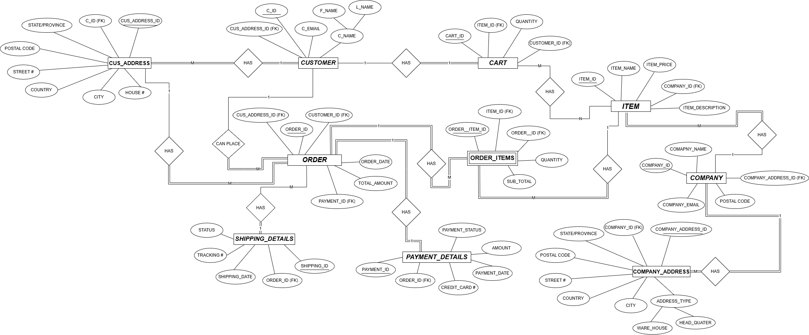
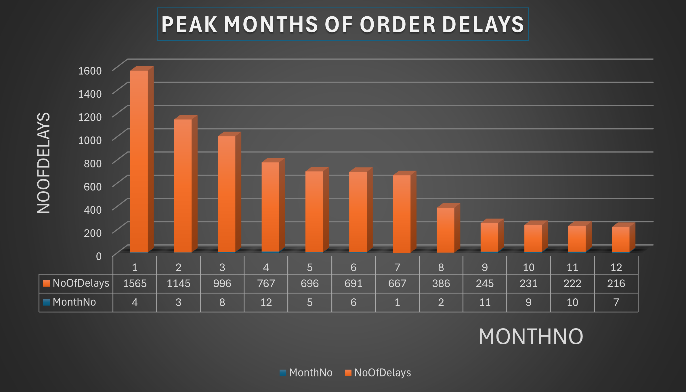
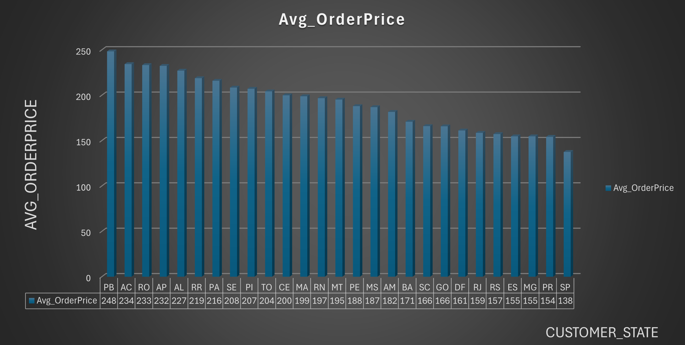
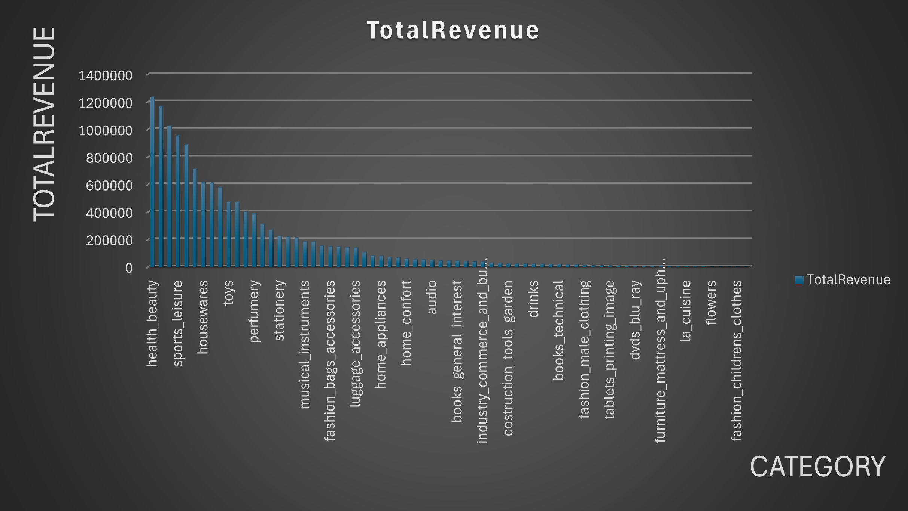
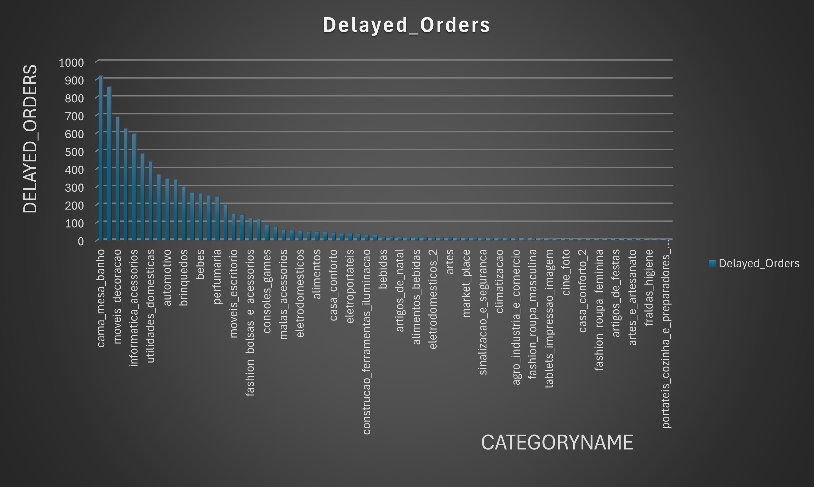
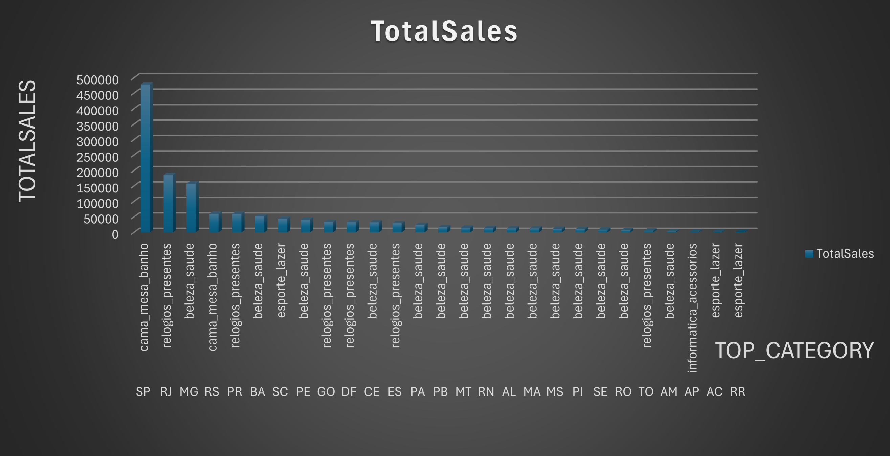
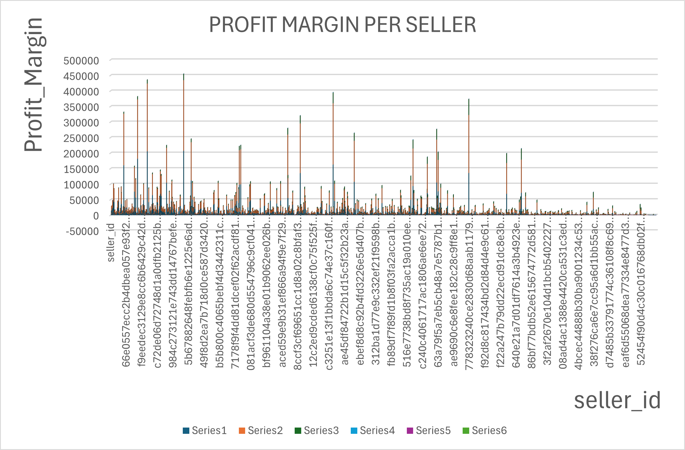

# Data Analysis — Olist E-commerce T-SQL, ER Modeling, and Northwind

Database coursework in **T-SQL (SQL Server)**: **Assignment #01** ER diagrams (draw.io), **Assignment #02** schema + `BULK INSERT` + analytical queries on the **Olist Brazilian e-commerce** dump, exported CSV/PNG result packs, and a separate **Northwind** sample-database script for extra practice.

**Author:** Mohammad Rohaan · **22I-2327** · [rohaan2802](https://github.com/rohaan2802)  
GitHub language: **TSQL**. Canonical assignment script: `Assignment #02/Assignment_2_i222327/Assignment #02_SQL.sql`.

## Table of contents

- [Screenshots / project demo](#screenshots--project-demo)
- [Problem statement / academic context](#problem-statement--academic-context)
- [Features](#features)
- [Architecture / design](#architecture--design)
- [File-by-file reference](#file-by-file-reference)
- [Olist schema](#olist-schema)
- [Bulk load (CSV → SQL Server)](#bulk-load-csv--sql-server)
- [Analysis questions A–H (as written)](#analysis-questions-ah-as-written)
- [Exported result highlights](#exported-result-highlights)
- [Assignment #01 — ER modeling](#assignment-01--er-modeling)
- [Northwind](#northwind)
- [Tech stack](#tech-stack)
- [Project structure](#project-structure)
- [Prerequisites and install](#prerequisites-and-install)
- [How to build and run](#how-to-build-and-run)
- [Known limitations / bugs](#known-limitations--bugs)
- [How to extend](#how-to-extend)
- [Author](#author)

## Screenshots / project demo

Key visuals from Assignment #01–#02 so you can see the working analysis without opening SSMS first. Full chart packs also sit under each `*_ANALYSIS` folder.

### ER model (Assignment #01)

Conceptual ER diagram for customers, orders, items, shipping, and payments.



### Peak months of order delays

Orders delivered after the estimated date, grouped by month. April is the worst month (**1,565** delays), July the lightest (**216**).



### Order delays by customer state

Geographic view of late deliveries. **SP** leads with **2,387** delayed orders, followed by RJ and MG.


### Average order price by state

Customer spend by Brazilian state. **PB** is highest (~**248.33**); **SP** is lowest among the listed states (~**137.50**).



### Revenue by product category

Delivered sales revenue with English category names. Top categories: **health_beauty**, **watches_gifts**, and **bed_bath_table**.



### Order delays by product category

Which product categories see the most late deliveries — useful for spotting fulfillment risk by catalog segment.



### Average review score by category

Mean customer review (1–5) per product category. High scores with tiny sample sizes (e.g. fashion children’s clothes) should be read carefully.


### Top product category by state

Most profitable category (total sales) in each customer state — e.g. SP led by bed/bath, RJ by watches/gifts.



### Seller profit margin proxy

Per-seller margin as `(price − freight) / price`. This uses freight as a cost stand-in, not true COGS.



## Problem statement / academic context

Olist is a Brazilian marketplace: customers, sellers, orders, payments, items, reviews, products, geolocation, and Portuguese→English category names. Assignment 02 asks you to **create an `ECOMMERCE` database**, load the official CSVs with **`BULK INSERT`**, enforce CHECKs and FKs, **deduplicate geolocation**, then answer **four blocks of questions** (Order / Customer / Product / Seller-and-shipment), each labeled **a–h** in the SQL comments. Results were saved as CSVs and PNGs under `CUSTOMER ANALYSIS`, `ORDER ANALYSIS`, `PRODUCT ANALYSIS`, and `SELLER AND SHIPMENT ANALYSIS`.

## Features

- `CREATE DATABASE ECOMMERCE` + `USE ECOMMERCE` with `GO` batches.
- Tables with PKs, FKs (`ON DELETE CASCADE` on several), and domain CHECKs (order status list, payment types, review scores 1–5, lat/lng ranges).
- UTF-8 bulk load: `CODEPAGE = '65001'`, `FIRSTROW = 2`, `KEEPNULLS` / `TABLOCK` where specified.
- Geolocation **staging** table + `ROW_NUMBER()` CTE to keep one lat/lng per `(zip, city, state)`.
- 32 analysis `SELECT`s (8 per theme) using `DATEDIFF`, `DATEPART`, `YEAR`/`MONTH`, window-style max-per-group subqueries, and `UNION ALL`.
- End-of-file note on **why `TABLOCK`** speeds bulk insert (minimal logging, lock escalation).
- Assignment 01: three section-A draw.io models (+ PNG exports).
- Northwind: Microsoft-style `CREATE DATABASE Northwind` script (~1 MB) with tables, views, and procedures.
- README screenshots under `docs/screenshots/` for a quick visual demo.

## Architecture / design

```
olist_*.csv  ──BULK INSERT──►  ECOMMERCE (SQL Server)
                                      │
                    Task 1: DDL + cleaning (geo CTE, CHECKs)
                                      │
                    Task 2: retrieval (Order / Customer / Product / Seller)
                                      │
                         CSV + PNG exports (SSMS / Excel)
```

**Load order that actually satisfies FKs** (the `.sql` file itself creates `Customers` *before* `Geolocation` and `Products` *before* `Product_Catery_Name_Translation`). Create **Geolocation** and **Product_Catery_Name_Translation** first, then Customers / Sellers / Products, then Orders and children. See [Known limitations](#known-limitations--bugs).

## File-by-file reference

| Path | Role |
|------|------|
| `Assignment #02/Assignment_2_i222327/Assignment #02_SQL.sql` | Full T-SQL (GitHub). |
| `Assignment #02/Assignment_2_i222327/olist_*.csv` | Olist dumps used for bulk insert. |
| `product_category_name_translation.csv` | Category PT→EN. |
| `Date_Time Format.txt` | `yyyy-MM-dd HH:mm:ss` |
| `CUSTOMER ANALYSIS/*.csv`, `*.png` | Customer queries C, E, H (and charts). |
| `ORDER ANALYSIS/` | Order queries B, C, E, G. |
| `PRODUCT ANALYSIS/` | Product queries A, B, D, E, F, G. |
| `SELLER AND SHIPMENT ANALYSIS/` | Seller queries A, B, C, G. |
| `docs/screenshots/` | Key PNGs embedded in the README demo section. |
| `Assignment #02/Brazilian_Dataset/` | Second copy of the nine CSVs. |
| `Assignment #01/*.drawio`, `*.png`, `.docx`, `.pdf` | ER modeling. |
| `NorthWind DataBase/NorthWind DataBase.sql` | Classic Northwind install script. |

Not every a–h query has a CSV in those folders (only the listed letters). Numbers in [Exported result highlights](#exported-result-highlights) come from those CSVs, not from invented query runs.

## Olist schema

Column `product_catery_name` is spelled that way **on purpose** (matches a misspelling used throughout the script and the translation table).

| Table | Keys / CHECKs (from DDL) |
|-------|--------------------------|
| `Geolocation` | PK `(geolocation_zip_code_prefix, geolocation_city, geolocation_state)`; zip `> 0`; lat −90…90; lng −180…180; state `LEN = 2`. |
| `Geolocation_Staging` | Same columns without the 2-letter state CHECK; dropped after insert. |
| `Customers` | PK `customer_id` ≠ `''`; `customer_unique_id` ≠ `''`; zip `> 0`; FK to Geolocation **ON DELETE CASCADE**. |
| `Sellers` | PK `seller_id`; zip `> 0`; FK to Geolocation. |
| `Product_Catery_Name_Translation` | PK Portuguese name; English name `NOT NULL`. |
| `Products` | PK `product_id`; FK category name; photos 0–50; name length ≥ 1; dimensions `> 0` where set. |
| `Orders` | PK `order_id`; status **IN** `delivered, shipped, processing, canceled, unavailable, invoiced, created, approved`; FKs to Customers CASCADE; CHECKs: approved ≥ purchase, carrier ≥ approved, customer delivery after carrier and purchase, estimate ≥ purchase. Timestamps nullable. |
| `Order_Payments` | PK `(order_id, payment_sequential)`; sequential ≥ 1; type **IN** `credit_card, boleto, voucher, debit_card, not_defined`; installments `> 0`; value ≥ 0. |
| `Order_Items` | PK `(order_id, order_item_id)`; FKs to Orders, Products, Sellers CASCADE; `price` and `freight_value` ≥ 0. |
| `Order_Reviews` | PK `(review_id, order_id)`; score **1–5**; answer timestamp ≥ creation when both set. |

## Bulk load (CSV → SQL Server)

This is **T-SQL / SQL Server**, not MySQL. Pattern used throughout:

```sql
BULK INSERT Orders
FROM 'C:\Users\ALLEN PROGRAMMER\Downloads\olist_orders_dataset.csv'
WITH (
    FORMAT = 'CSV',
    FIELDTERMINATOR = ',',
    ROWTERMINATOR = '\n',   -- some tables use '0x0A'
    FIRSTROW = 2,
    CODEPAGE = '65001',     -- UTF-8 (not on every statement)
    KEEPNULLS,              -- Orders, Products, Reviews
    TABLOCK
);
```

**Replace every `FROM` path** before running. Original machine: `C:\Users\ALLEN PROGRAMMER\Downloads\`. Point the nine Olist files plus `product_category_name_translation.csv` at your copies under `Assignment_2_i222327/` or `Brazilian_Dataset/`.

Customers’ `BULK INSERT` in the script **omits** `CODEPAGE` (Orders/Payments/Products include `65001`). `Order_Items` / Reviews / geo use `DATAFILETYPE = 'char'` and `ROWTERMINATOR = '0x0A'`. Date strings must match `yyyy-MM-dd HH:mm:ss` (`Date_Time Format.txt`).

**MySQL users:** there is no `LOAD DATA` script here. Equivalent would be `LOAD DATA LOCAL INFILE` with UTF-8 and a matching schema; CHECKs and `DATEDIFF`/`DATEPART` need dialect changes. The submitted work is SQL Server.

Geolocation insert (after staging load):

```sql
WITH UniqueGeo AS (
    SELECT *, ROW_NUMBER() OVER (
        PARTITION BY geolocation_zip_code_prefix, geolocation_city, geolocation_state
        ORDER BY geolocation_lat, geolocation_lng
    ) AS rn
    FROM Geolocation_Staging
)
INSERT INTO Geolocation (...)
SELECT ... FROM UniqueGeo WHERE rn = 1;
```

A commented `GROUP BY` + `MIN(lat/lng)` alternative sits above the CTE.

## Analysis questions A–H (as written)

Wording below is from the SQL comments (typos included). “RETURN MORE THAN 10” is an assignment output-size hint.

### Order analysis

| | Question | Query idea |
|--|----------|------------|
| a | Percentage of orders that delayed beyond the estimated date | `%` where `delivered_customer > estimated` |
| b | Peak months of order delays? (RETURN MORE THAN 10) | `MONTH(...)` counts |
| c | Which state experiences the highest order delays? | Join `Customers`, group by `customer_state` |
| d | How many orders are still in “pending” status for each year | `order_status = 'processing'` |
| e | Average delay duration per seller? | `AVG(DATEDIFF(DAY, estimated, delivered))` |
| f | How do shipping costs impact order delays? | Avg `freight_value` Delayed vs On-Time |
| g | Which product catery experience the most order delays | Count delays by `product_catery_name` |
| h | How do number of items per order affect the delays? | Avg items Delayed vs On-Time (`SUM(order_item_id)` as `item_count`) |

### Customer analysis

| | Question | Query idea |
|--|----------|------------|
| a | What percentage of customers have made only one order? | `customer_unique_id` with `COUNT(order_id)=1` |
| b | Top five cities with the most repeat customers | `HAVING COUNT(order_id) > 1`, `TOP 5` cities |
| c | Average order price of customers for each state | `AVG(payment_value)` |
| d | Top ten customers with the highest number of orders | `TOP 10` by order count |
| e | Which customers have the longest average delivery time | `AVG(DATEDIFF(DAY, approved, delivered))` for delivered |
| f | Average number of orders placed per customer per year | `COUNT(orders)/COUNT(DISTINCT unique_id)` |
| g | Which top 5 customers have spent the most money in year 2017 | Delivered, 2017 window, `SUM(payment_value)` |
| h | Which customers have the highest order cancellations | `order_status = 'canceled'` |

### Product analysis

| | Question | Query idea |
|--|----------|------------|
| a | Most profitable product catery per state (total sales) | Max `SUM(price)` category per `customer_state` |
| b | Peak hours for order placements per product catery | Hour with max count per category |
| c | Top 5 product cateries with the highest number of delayed orders | English names via translation |
| d | Impact of product price on sales volume | Avg price vs `COUNT` of delivered orders |
| e | Most frequently bought together product pairs | Self-join `product_id < product_id` |
| f | Total revenue per product catery | `SUM(price)` delivered, English name |
| g | Average review score for each product catery | `AVG(review_score)` |
| h | Top 5 products based on total sales revenue | `TOP 5` `SUM(price)` |

### Seller and shipment analysis

| | Question | Query idea |
|--|----------|------------|
| a | What is the return rate per seller? | Canceled item-rows / all item-rows × 100 (**cancellations**, not returns) |
| b | Sellers whose products have the highest average price | `AVG(price)` on delivered |
| c | Profit margin per seller | `(price − freight_value)` and that as % of `SUM(price)` |
| d | Average shipping cost delayed vs non-delayed | `UNION ALL` two avgs |
| e | Number of delayed shipments in 2017 | Count delivered late, purchase year 2017 |
| f | Correlation between shipping cost and delivery speed | Same freight avg delayed vs on-time as (d) |
| g | Sum the total freight cost for each seller | `SUM(freight_value)` delivered |

## Exported result highlights

From the GitHub CSV packs (headers as exported):

**Order B — delays by month:** April **1565**, March **1145**, August **996**, then Dec 767 … July **216** (12 months).

**Order C — delays by state (top / bottom):** SP **2387**, RJ **1664**, MG **638**, … AC **3**, AP **3**.

**Order E — mean delay days by seller (head):** **167**, **159**, **134**, **132**, **100** days (seller ids in the CSV).

**Customer C — mean payment by state:** PB **248.33** (highest), AC 234.29, … SP **137.50** (lowest of the 27 rows).

**Customer H — cancellations:** one `customer_unique_id` with **3** canceled orders; several with **2**; long tail of **1**.

**Product A — top category sales by state:** SP `cama_mesa_banho` **478284.52**; RJ `relogios_presentes` **185379.65**; MG `beleza_saude` **157558.30**.

**Product B — peak order hour (examples):** `cama_mesa_banho` hour **14**, count **802**; `beleza_saude` hour **16**, **697**.

**Product F — revenue (English names, delivered `SUM(price)`):** `health_beauty` **1,233,131.72**; `watches_gifts` **1,166,176.98**; `bed_bath_table` **1,023,434.76**; lowest listed `security_and_services` **283.29**.

**Product G — mean review (exported as integers):** `fashion_childrens_clothes` **5** (7 reviews); many categories **4**; `telephony` / `office_furniture` / `bed_bath_table` **3**; `security_and_services` **2** (2 reviews). SQL uses `ROUND(AVG(...), 2)`; the CSV dump is coarsened.

**Seller A — “return” %:** several sellers at **100%** with `TotalOrders=1` and `CanceledOrders=1` (small-n artefact).

**Seller B — mean product price (head):** **6735**, **6729**, **6499**.

**Seller C — “profit margin %” (head):** **98.90%**, **98.73%**, **98.66%** on `(price − freight)/price` — freight is shipping, not COGS.

## Assignment #01 — ER modeling

- `DB_Assignment#1.pdf` — brief  
- `i222327_DB_Assignment#01.docx` — write-up  
- `i222327_TASK_1_sec_A.drawio` + PNG  
- `i222327_TASK_3_sec_A.drawio` + PNG  
- `i222327_TASK_5_sec_A.drawio` + PNG  

Open `.drawio` in [diagrams.net](https://app.diagrams.net/). A README copy is at [`docs/screenshots/01-er-diagram.png`](docs/screenshots/01-er-diagram.png).

## Northwind

`NorthWind DataBase/NorthWind DataBase.sql` is the classic **Microsoft Northwind** T-SQL installer (copyright header 1994–2000): `CREATE DATABASE Northwind`, then drop/recreate **Employees, Categories, Customers, Shippers, Suppliers, Orders, Products, Order Details**, plus Region/Territories/demographics, views (`Invoices`, `Order Subtotals`, `Sales by Category`, …), and procedures (`CustOrderHist`, `Ten Most Expensive Products`, …). **Purpose:** standalone SQL Server practice, **not** joined to Olist. Run in SSMS against a server where you may create `Northwind`. Default schema `dbo`, `SET DATEFORMAT mdy`.

## Tech stack

- SQL Server (Express/Developer) + SSMS or `sqlcmd`
- T-SQL: `BULK INSERT`, `GO`, `DATEDIFF`, `DATEPART`, `TOP`, `CTE`
- Olist CSVs (UTF-8); draw.io for Assignment 01

## Project structure

```
Data-Analysis/
├── docs/screenshots/        # README demo PNGs (key visuals)
├── Assignment #01/          # ER diagrams + brief
├── Assignment #02/
│   ├── Assignment_2_i222327/   # SQL, CSVs, analysis folders
│   └── Brazilian_Dataset/      # duplicate Olist CSVs
├── NorthWind DataBase/
│   └── NorthWind DataBase.sql
└── README.md
```

## Prerequisites and install

SQL Server with `BULK INSERT` permission and rights to `CREATE DATABASE`. Place CSVs on a path the **SQL Server service account** can read (not only your user Downloads folder).

## How to build and run

1. Edit every `BULK INSERT ... FROM` path.
2. In SSMS, create Geolocation (staging → CTE → drop staging) and `Product_Catery_Name_Translation` **before** tables that FK to them, **or** temporarily comment FKs, load, then `ALTER TABLE` add FKs.
3. Load remaining tables; `SELECT *` probes after each load are in the script (heavy on full Olist — consider `SELECT TOP 10`).
4. Run Task 2 blocks; compare to the analysis CSVs/PNGs (or the README screenshots under `docs/screenshots/`).
5. Optional: `sqlcmd -S .\SQLEXPRESS -E -i "Assignment #02\Assignment_2_i222327\Assignment #02_SQL.sql"` after path fixes.

Northwind: open `NorthWind DataBase.sql` and execute as a separate batch (creates `Northwind`).

## Known limitations / bugs

- **DDL order vs FKs:** `Customers`/`Sellers` reference `Geolocation` before it is created; `Products` references the translation table before it exists. Top-to-bottom execute will fail until you reorder.
- Typo **`catery`** everywhere; keep it or load will miss the FK.
- Order **h** uses `SUM(order_item_id)` as item count (sum of line numbers, not `COUNT(*)`).
- Seller **a** is cancel rate, not returns; **c** is price−freight, not COGS profit; **d** and **f** are the same freight-avg comparison.
- Customer **h** `ORDER BY cancelled_orders_count` vs alias `Cancelled_orders_count` may fail depending on collation.
- Analysis CSVs cover a **subset** of a–h; hard-coded Windows paths; Customers bulk insert may need `CODEPAGE`.
- Olist / Northwind retain upstream licenses (Olist dump; Microsoft Northwind sample).

## How to extend

- Reorder `CREATE TABLE` to match FKs; replace `SUM(order_item_id)` with `COUNT(*)`; index `order_status` / delivery dates; parameterize paths with `sqlcmd -v`.

## Author

**Mohammad Rohaan** — 22I-2327 · [rohaan2802](https://github.com/rohaan2802)
